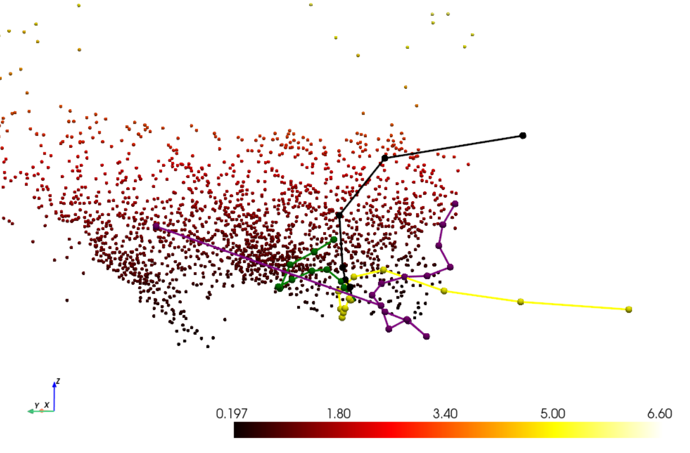

# VIO-SLAM
Loosely-coupled Visual Inertial Odometry SLAM implementation, with factor graph (GTSAM) and custom EKF. Also including 3d projection from stereo disparity, creating 3D pointcloud in global frame, based on global poses extracted from the fusion.

### A work in progress.

### Visualization

*Comparison of VIO-SLAM different trajectories, with PCL of frames 3d reconstruction.*
